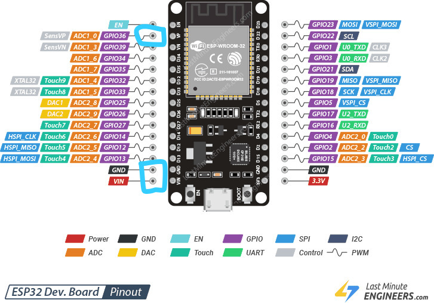
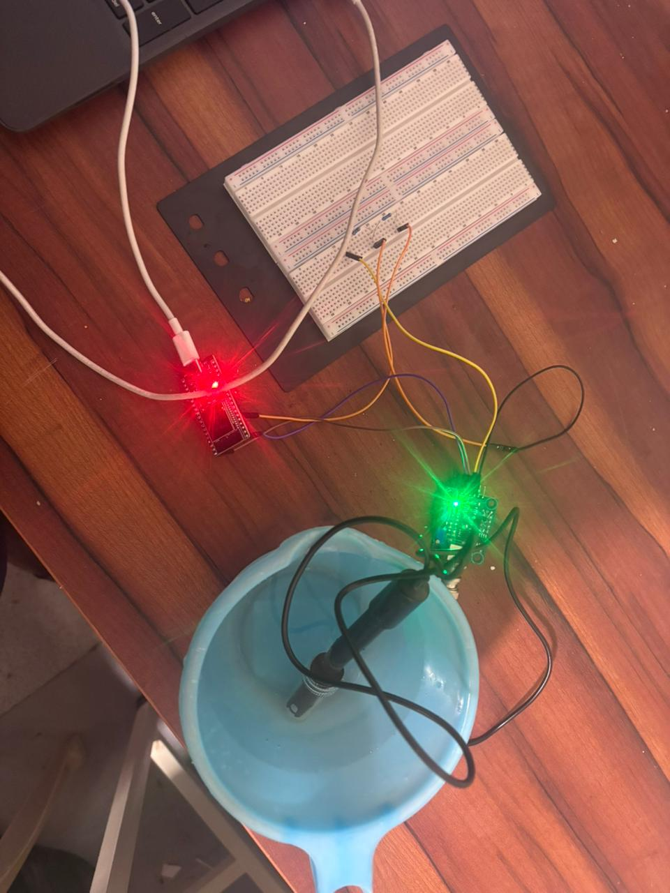
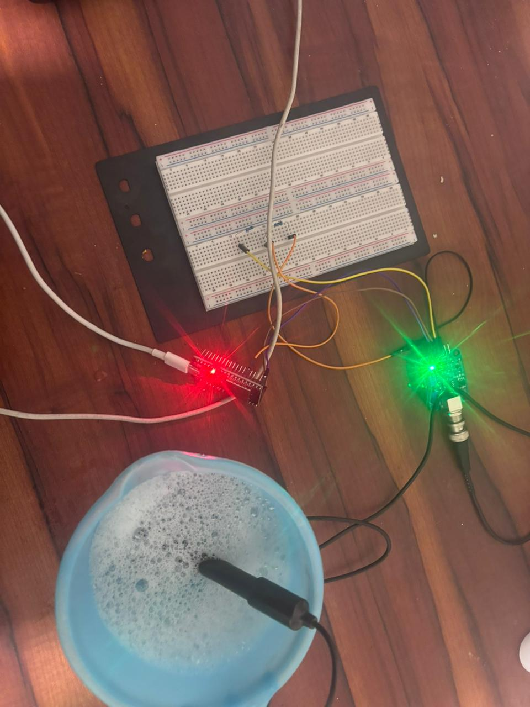

# Iot-Based Water pH Monitoring System using ESP32

##  Problem Statement 

Grey water discharged from individual households (such as water from bathrooms, kitchens, and washing areas) often contains high pH levels due to the presence of soaps, detergents, and cleaning chemicals.
When this untreated grey water is released into natural water bodies, it can damage aquatic life, affect soil quality, and make the water unsafe for reuse. 
Currently, monitoring and controlling household wastewater quality is a manual and large-scale responsibility handled mainly by government corporations, which makes real-time monitoring difficult.

## Motivation

To reduce environmental damage and distribute responsibility at the individual household level, there is a need for a simple, low-cost, real-time monitoring system that alerts users before harmful wastewater is discharged.

## Proposed Solution

This project implements an IoT-based Water pH Monitoring System using an ESP32 microcontroller and a pH sensor installed in the household wastewater discharge tank. 
The pH value of the discharged water is continuously monitored. If the pH exceeds the safe range, an instant alert notification is sent to the user’s mobile phone using Blynk IoT. 
Upon receiving the alert, the user can neutralize the water by adding readily available materials such as: Hydrochloric acid Dry acid Phosphoric acid White vinegar This reduces the pH to safe levels before discharge.

## Social & Environmental Impact

Prevents harmful wastewater from entering natural water bodies Encourages individual responsibility for environmental protection Reduces workload on government corporations Enables proactive action instead of post-damage control Supports sustainable water management practices If an alert is repeatedly ignored, the system can help authorities identify unresolved cases and take necessary action.

## Project Documentation

Detailed project documentation is available below:

-  [Components List](hardware/components_list.md)
-  [Hardware Connections](hardware/hardware_connections.md)
-  [System Architecture](docs/system_architecture.md)

## Project Setup & Results
### ESP32 and Sensor Connections

### PH Measurement -Pure Water

### PH Measurement -Grey Water

